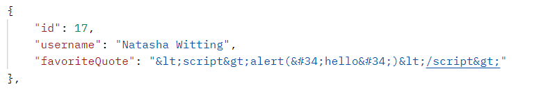
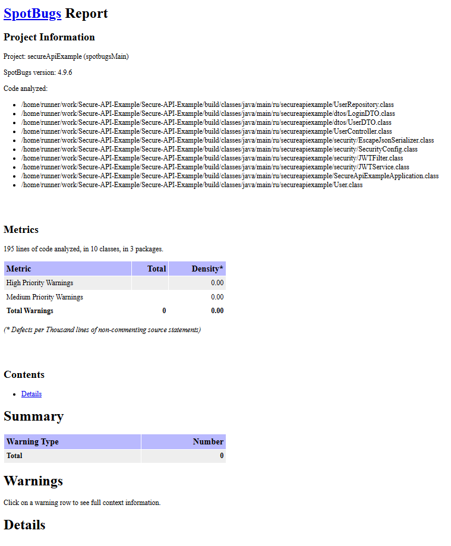
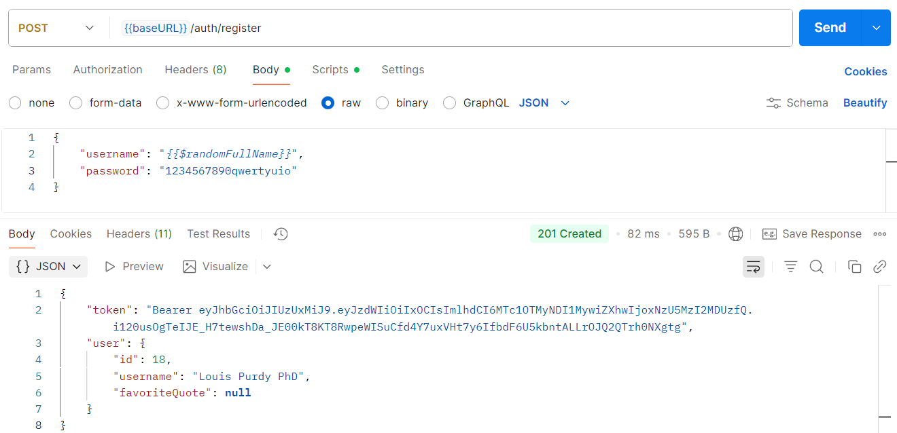
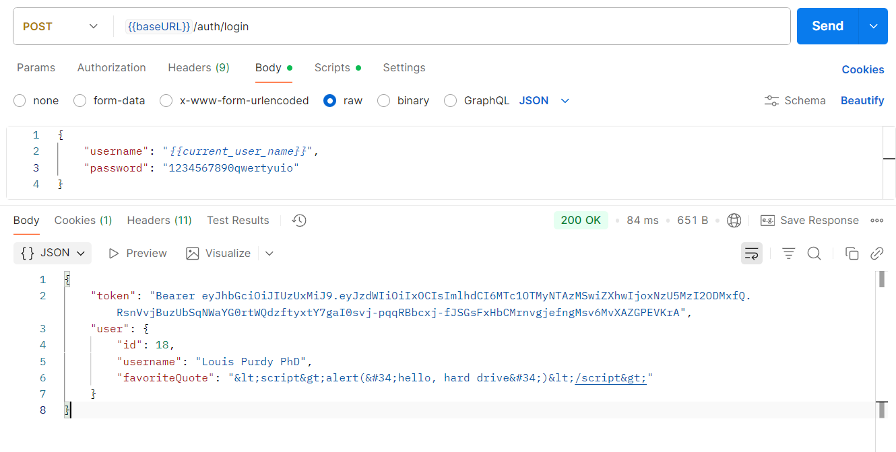
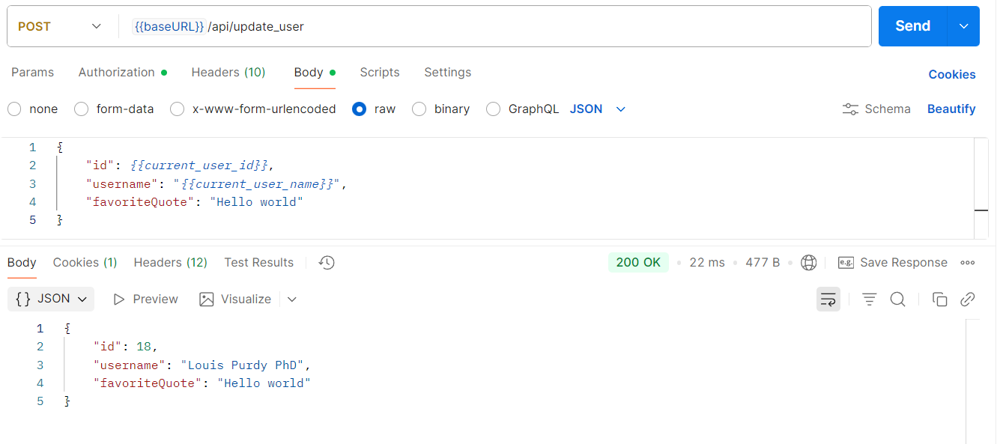
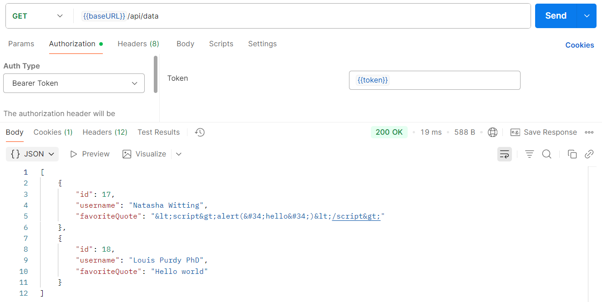
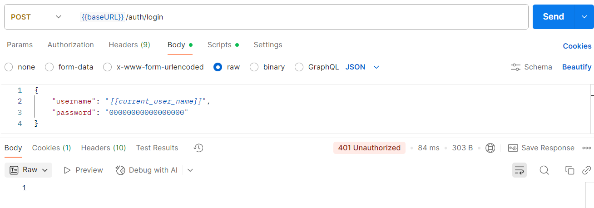
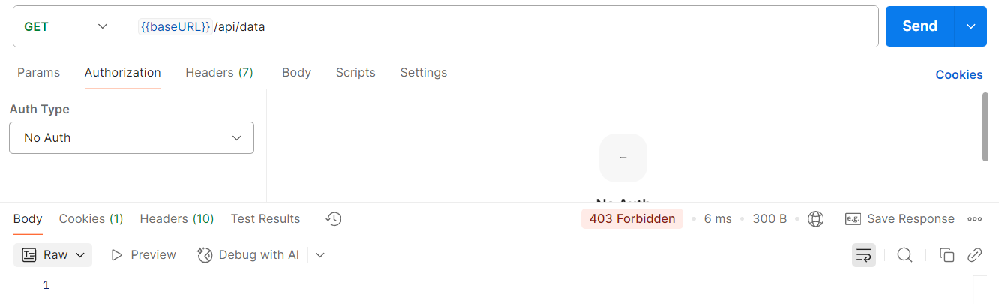

# Информационная безопасность. Лаб. 1

Данное приложение реализует функциональность хранения массива пользователей и их 
любимых цитат

Пользователь может:
- Регистрироваться
- Входить в систему по никнейму и паролю

Зарегистрированный пользователь может:
- Получать никнеймы и любимые цитаты других пользователей
- Изменять свои никнейм и любимую цитату

## Описание эндпоинтов

- `auth/login` - осуществить вход пользователя в систему
  - Принимает в теле запроса: 
    - `username` - строка длинной от 4 до 32 символов
    - `password` - строка длинной от 8 до 64 символов
  - Аутентификация: -
  - Возвращает: 
    - `200 Ok`, данные о пользователе и токен в теле ответа, если пользователь существует и успешно вошел в систему
    - `404 Not Found`, если пользователя с таким именем не существует
    - `401 Unauthorized`, если пароль неверный


- `auth/register` - зарегистрировать нового пользователя
  - Принимает в теле запроса:
    - `username` - строка длинной от 4 до 32 символов, уникальное имя пользователя
    - `password` - строка длинной от 8 до 64 символов
  - Аутентификация: -
  - Возвращает:
    - `201 Created`, данные о пользователе и токен в теле ответа, если пользователь успешно добавлен
    - `409 Conflict`, если пользователь с таким именем уже зарегистрирован


- `api/data` - получить информацию о всех пользователях
  - Принимает в теле запроса: -
  - Аутентификация: токен формата `Bearer eyJhbGciOiJSUzIA...` в заголовке `Authorization`
  - Возвращает:
    - `200 Ok` и список с информацией о всех пользователях
    - `401 Unauthorized`, если токен не передан, невалиден или просрочен
 

- `auth/update_user` - обновить информацию о пользователе
  - Принимает в теле запроса: 
    - `id` пользователя (собственный) 
    - `username` - строка длинной от 4 до 32 символов
    - `favoriteQuote` - строка или null
  - Аутентификация: токен формата `Bearer eyJhbGciOiJSUzIA...` в заголовке `Authorization`
  - Возвращает:
    - `200 Ok` и обновленную информацию о пользователе
    - `401 Unauthorized`, если токен не передан, невалиден или просрочен
    - `403 Forbidden`, если переданный id не соответствует id полученному из токена
    - `404 Not Found`, если пользователь не найден
    - `409 Conflict`, если пользователь изменил имя, но с таким именем уже зарегистрирован другой пользователь


## Реализованные меры защиты

### От SQLi

Использование Spring Data JPA, который автоматически генерирует  
запросы к базе данных исходя из имени метода. 

Оно генерирует **параметризованные** запросы, 
то есть вместо параметров в них подставлены знаки `?`.
Параметры же запроса передаются отдельно (не используя конкатенацию). 
Это предотвращает исполнение пользовательского ввода как кода SQL.

```java
public interface UserRepository extends CrudRepository<User, Long> {
    User findUserByUsername(String username);
}
```

### От XSS

Использование кастомного JSON-сериализатора для всех возвращаемых строк.
В сериализаторе символы ` & < > " ' ` заменяются на их аналоги `&amp; &lt; &gt; &#34; &#39;`.

Таким образом, опасные (с точки зрения XSS) символы заменяются на их безопасные аналоги. 
Что помогает предотвратить возможную атаку.


```java
public class EscapeJsonSerializer extends JsonSerializer<String> {
    @Override
    public void serialize(String value, JsonGenerator gen, SerializerProvider serializers) throws IOException {
        gen.writeString(Encode.forHtml(value));
    }
}
```

```java
public class UserDTO {

    @JsonSerialize(using = EscapeJsonSerializer.class)
    private String favoriteQuote;

    // other fields and methods...
}
```

Пример работы данной меры защиты:




### От Broken Authentication

- При регистрации/входе пользователя ему выдается токен. Токен содержит информацию 
  о пользователе - его уникальный id. Токен подписан секретным ключом, и имеет ограниченное 
  время жизни. Токен используется при запросах к API для 
  аутентификации пользователя (проверка подлинности токена и что он не истёк) и 
  идентификации пользователя (т.е получения его id). 

- для всех защищенных эндпоинтов (`/api/**`) настроен доступ только при условии, что в запросе 
  передан валидный непросроченный токен 
  (см. [SecurityConfig.java](src/main/java/ru/secureapiexample/security/SecurityConfig.java))

- Пароли хранятся в защищенном виде - закодированные алгоритмом bcrypt. 
  Минимальная длинна пароля - 8 символов, что дает дополнительную защиту


## Отчет spotbugs



Документ: [spotbugs.html](assets/spotbugs.html)


## Последний успешный пайплайн

https://github.com/Kliodt/Secure-API-Example/actions


## Примеры запросов (Postman)

### Примеры корректной работы эндпоинтов

- `/auth/register_user`
  

- `/auth/login`
  

- `/api/update_user`
  

- `/api/data`
  

### Пример попытки логина по неправильному паролю



### Пример попытки неавторизованного доступа к API

